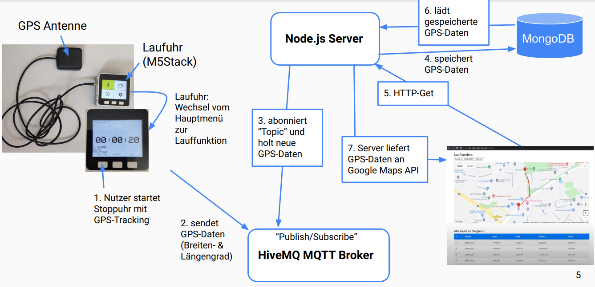
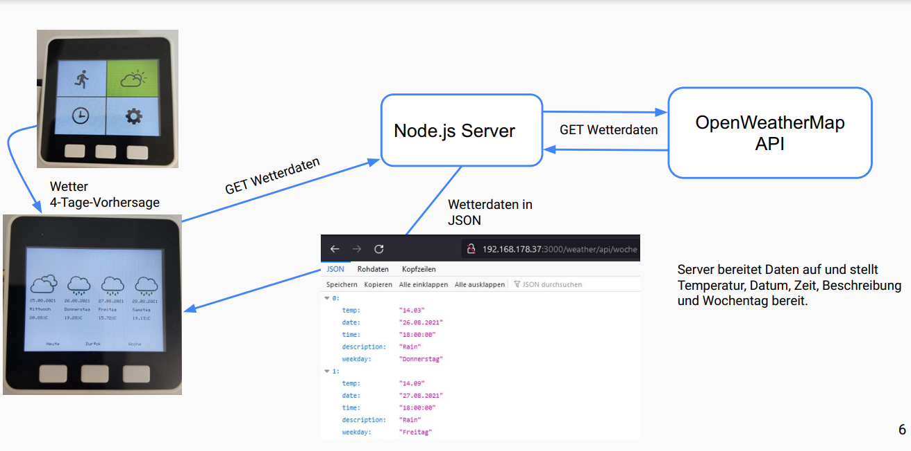

# RunTracker - A Prototype GPS Running Watch using M5Stack, NodeJS, and MongoDB

## Description

The aim of this project is to develop a prototype running watch with several functions. These include GPS tracking, today's weather data and a 4-day forecast, a stopwatch, and a time display. The weather data and time should be visible on the M5Stack. A main menu should be developed to switch between these functions. The M5Stack will be used with the GPS module to enable the transmission of GPS data. The GPS data will be sent via a Message Queuing Telemetry Transport (MQTT) broker to a Node.js server specifically developed for this project. After a run, the user of the running watch should be able to view the completed route in the browser on Google Maps.

## Overview - GPS Tracking function Flow

## Overview - Weather function Flow

